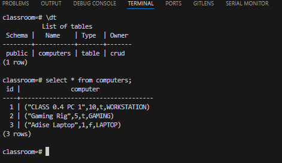

# CRUD

### 1. What is the CRUD concept?

`CRUD` is an acronym for `Create`, `Read`, `Update` and `Delete`. In the context of a BBDD It's usually refering to the program that handles these actions on the database.

#### 1.1 Object and Structure

For this exercise I choose the following structure:

- **DATABASE NAME**: `classroom`
- **TABLE NAME**: `computers`
- **OBJECT NAME**: `Computer`

```json
// COMPUTER STRUCTURE
{
  "n_of_users": "INT",
  "name": "String",
  "is_active": "BOOL",
  "type": ["WORKSTATION", "GAMING", "LAPTOP"]
}
```

<br/>

### 2. Creating the Table, Enum, Object and inserting the initial records

You can find the `SQL` statements used to create the table and enum in the [2-CreatingStructures_Table-Enum.sql](./sql/2-CreatingStructures_Table-Enum.sql) file.



Proof of creation

<br/>

## 2. Proof

I did not follow standard as I thought the best approach was to record a simple video.
